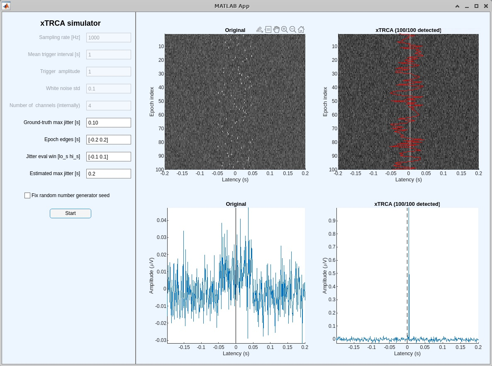

# simulate_xTRCA
This is a simulator for Hiro Tanaka's cross-correlation task-related component analysis (xTRCA; Tanaka and Miyakoshi, 2019 NeuroImage). The simulator generates 100 impulses with an amplitude of 1 every second embedded with weak white noise (standard deviation 0.1). Users add varying amounts of temporal jitter so that the trigger label and actual latency of the trigger signal are no longer consistent. Finally, the algorithm de-jittering the data to recover the states before adding the jitter.

A couple of important notes:

- A latency of zero indicates the onset of the impulse.
- The added jitter is relative to the latency of zero.
- The plot shows data from only one channel, but internally there are four channels. xTRCA is a multivariate method, which sets it apart from time-domain de-jittering using cross-correlation.

Based on the results from this simulator, it is evident that **the search window width should be at least four times greater than the width of the ground-truth jitter**.
